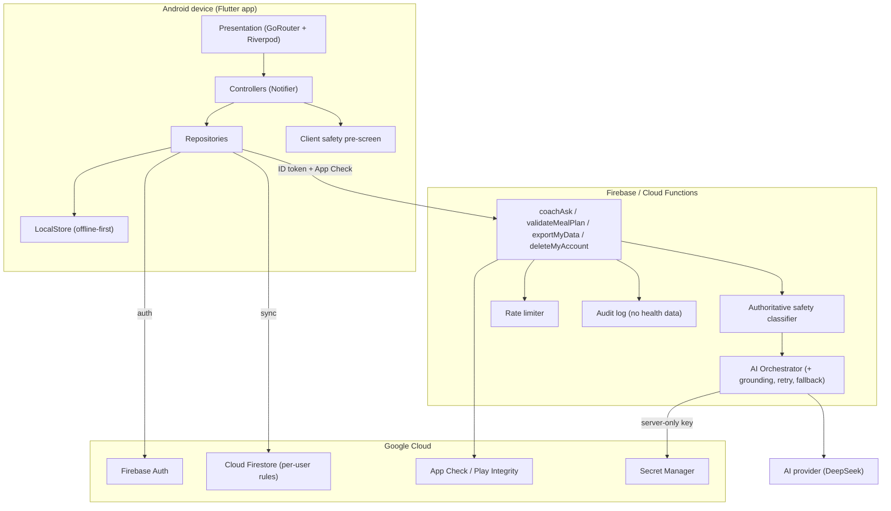
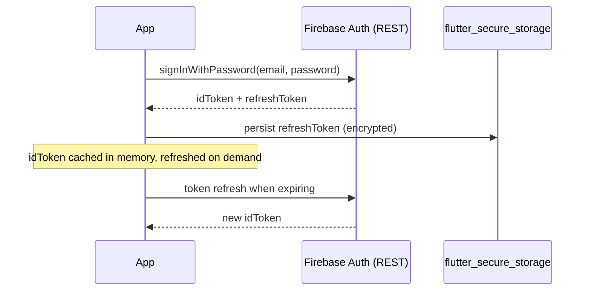
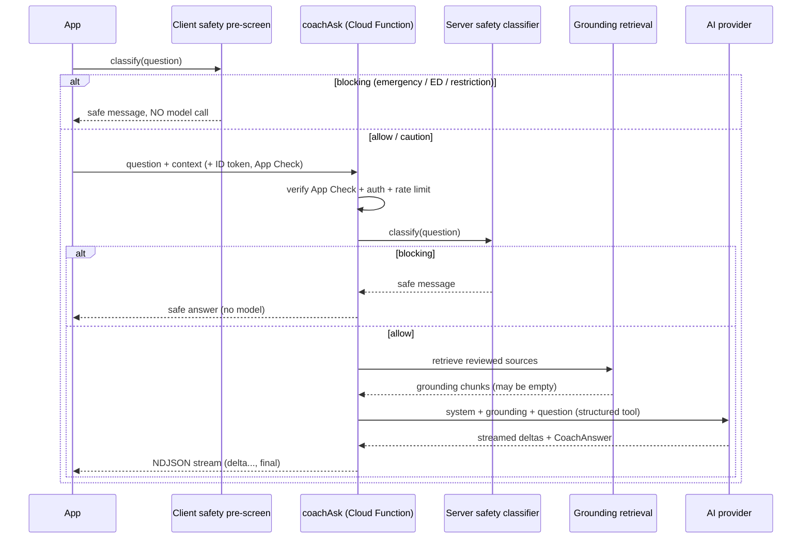
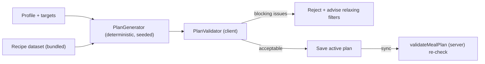
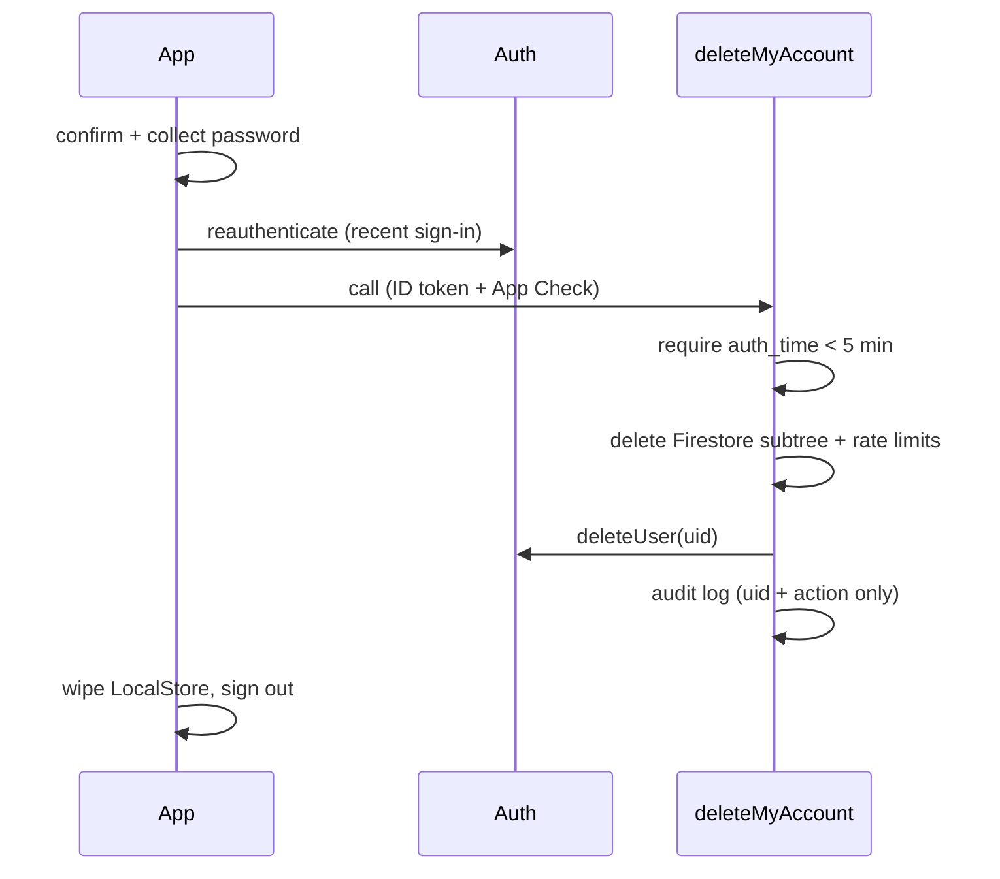
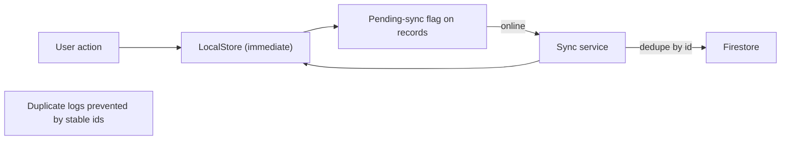
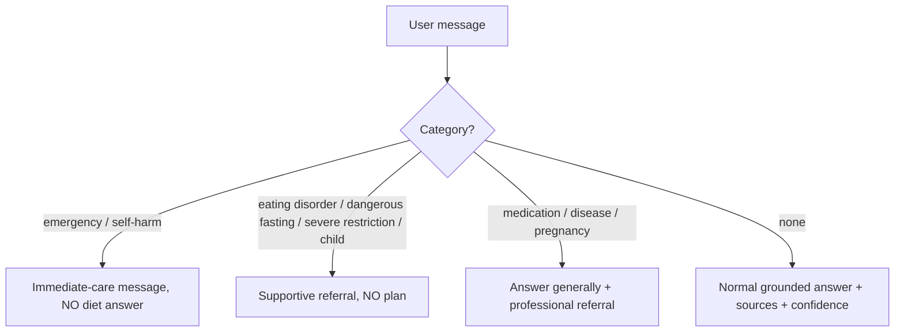

# NutriGuide AI — Architecture

NutriGuide AI is a Flutter (Android) wellness and nutrition app with a secure
Firebase/Cloud Functions backend and an evidence-grounded AI Nutrition Coach.
It is local-first (fully usable offline) and privacy-first (health data is
treated as sensitive and never used for advertising).

## Guiding principles

- **Clean, feature-first architecture.** Each feature owns `domain/` (pure
  models + logic), `data/` (repositories), `application/` (Riverpod
  controllers) and `presentation/` (widgets).
- **Local-first.** All user data persists through `LocalStore`; the sync layer
  mirrors it to Firestore. The app works offline and never blocks on network.
- **Secrets stay server-side.** The app holds only public client identifiers.
  AI provider keys, service accounts and prompts live in the backend secret
  manager. A production build cannot use development stubs (enforced by
  `AppEnvironment.guardProductionIntegrity`).
- **Safety is layered.** A client pre-screen and an authoritative server-side
  classifier both gate the AI Coach; high-risk inputs never receive a diet
  answer.

## Layers

| Layer | Location | Responsibility |
|-------|----------|----------------|
| Design system | `app/lib/core/design` | Tokens, theme, reusable components |
| Storage | `app/lib/core/storage` | `LocalStore` local-first JSON store |
| Domain | `app/lib/features/*/domain` | Pure models + business logic (tested) |
| Data | `app/lib/features/*/data` | Repositories, auth, AI service adapters |
| Application | `app/lib/features/*/application` | Riverpod `Notifier` controllers |
| Presentation | `app/lib/features/*/presentation` | Screens and widgets |
| Backend | `backend/functions/src` | AI orchestration, safety, validation, lifecycle |

## System architecture

## Authentication flow

## AI request flow

## Meal-plan generation

## Data-deletion flow

## Offline synchronization

## Safety-escalation flow

## Monetization (feature-flagged)

Monetization ships behind `FeatureFlags.monetizationEnabled` (default off). The
entitlement logic (`features/settings/domain/entitlements.dart`) already
gates AI fair-use limits, advanced analytics and multiple programs, while
account deletion and data export are **never** gated. Google Play Billing is
the integration slot; the app launches fully functional without it.

## State management

Riverpod `Notifier`/`NotifierProvider` (Riverpod 3.x). Controllers read
repositories via `ref.watch` in `build()`; providers are defined in
`app/lib/app/providers.dart`. GoRouter redirects on session + profile state.
